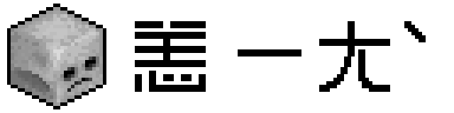

# I Feel Bad



[简体中文](documents/README__zh_CN.md)

## 1. abstract

- A lightweight and highly configurable Minecraft mod that tweaks **death penalties**, level-up **experience requirements**, and the default attributes of newly spawned entities
- mod id = `i_feel_bad`
- **LICENSE** = `GNU Lesser General Public License v3.0`

## 2. introduce

- `i_feel_bad` has introduced the following tweaks:
  - Enhancing death penalties
    - Re-balanced respawn state:
      - After death, player attributes are recalculated, turning respawning into a genuine setback instead of the vanilla “free refill” of hunger and health (especially when  `keep_inventory`  is on).
    - Post-respawn debuffs:
      - Players respawn with negative status effects that last for a configurable duration, forcing more cautious play.
  - Additional tweaks
    - Experience rework:
      - Optionally replaces Minecraft’s exponential level curve with linear or flat progression.
    - Mob attribute editing:
      - Lets you adjust the base attributes of any mob as it spawns, enabling fine-grained buffs or nerfs.
- Every feature can be toggled independently and comes with extensive configuration options; disable anything you don’t need—no side effects.

## 3. server or client

- This is a pure server-side module. If it is used on the server, then this module is not necessary on the client side

## 4. config

- Below is a typical default configuration file (NeoForge version):

  ```toml
  # common settings for module I Feel Bad
  [I_FEEL_BAD]
  # enable i_feel_bad (this mod); false to disable all
  flag__enable_i_feel_bad = true
  # generating logs during the operation of the module
  flag__enable_logging = false
  # check whether the configuration is valid
  flag__enable_config_check = false

  # Configurations related to health point modification
  [hp_modification]
  # false to disable modification behavior
  flag__enable_modification = true
  # the modification is achieved through function y=kx+b, this is k;
  # here y represents the new value (hp at respawn), x the old value (hp at death);
  # Default: 1.0
  # Range: -10000.0 ~ 10000.0
  coefficient__k = 1.0
  # the modification is achieved through function y=kx+b, this is b;
  # Default: -4.0
  # Range: -10000.0 ~ 10000.0
  coefficient__b = -4.0
  # the revised target value will not be lower than this value;
  # this value should be lower than the maximum;
  # Default: 2.0
  # Range: 0.0 ~ 10000.0
  minimum = 2.0
  # the revised target value will not exceed this limit;
  # Default: 100.0
  # Range: 0.0 ~ 10000.0
  maximum = 100.0

  # Configurations related to food level (fullness) modification
  [food_level_modification]
  # false to disable modification behavior
  flag__enable_modification = true
  # the modification is achieved through function y=kx+b, this is k;
  # here y represents the new value (food_level at respawn), x the old value (food_level at death);
  # Default: 0.5
  # Range: -10000.0 ~ 10000.0
  coefficient__k = 0.5
  # the modification is achieved through function y=kx+b, this is b;
  # Default: 2.0
  # Range: -10000.0 ~ 10000.0
  coefficient__b = 2.0
  # the revised target value will not be lower than this value;
  # this value should be lower than the maximum;
  # Default: 7.0
  # Range: 0.0 ~ 10000.0
  minimum = 7.0
  # the revised target value will not exceed this limit;
  # Default: 100.0
  # Range: 0.0 ~ 10000.0
  maximum = 100.0

  # Configurations related to saturation modification
  [saturation_modification]
  # false to disable modification behavior
  flag__enable_modification = true
  # the modification is achieved through function y=kx+b, this is k;
  # here y represents the new value (saturation at respawn), x the old value (saturation at death);
  # Default: 0.0
  # Range: -10000.0 ~ 10000.0
  coefficient__k = 0.0
  # the modification is achieved through function y=kx+b, this is b;
  # Default: 0.0
  # Range: -10000.0 ~ 10000.0
  coefficient__b = 0.0
  # the revised target value will not be lower than this value;
  # this value should be lower than the maximum;
  # Default: 0.0
  # Range: 0.0 ~ 10000.0
  minimum = 0.0
  # the revised target value will not exceed this limit;
  # Default: 0.0
  # Range: 0.0 ~ 10000.0
  maximum = 0.0

  # Configurations related to status effect assignment
  [status_effect_assignment]
  # enable status effect assignment after player respawn
  flag__enable_status_effect_assignment = true
  # a list of status effect record; fields:
  # string id | int *duration (in tick) | int *level (amplifier, [0, 255)) | bool *ambient | bool *visible | bool *show_icon
  # fields can be omitted (excluding ID) to use their default values;
  # for example:
  #   [0] "minecraft:slowness,3000,"
  #   [1] "minecraft:slowness,,,"
  #   [2] "minecraft:slowness,,2,"
  # common negative effect ids (also support positive effects):
  # minecraft:slowness|mining_fatigue|instant_damage|blindness|hunger|weakness|darkness|...
  # see details on wiki: https://minecraft.wiki/w/Effect
  list__status_effect_assignment_records = ["minecraft:infested,6000,0,false,true,true", "minecraft:mining_fatigue,3600,0,false,true,true", "minecraft:slowness,600,0,false,true,true", "minecraft:weakness,500,0,false,true,true", "minecraft:darkness,400,0,false,true,true"]

  # Configurations related to modification of the experience mechanism
  [experience_mechanism_modification]
  # enable level exp requirement method coverage
  flag__enable_coverage = true
  # the necessary basic experience for upgrading
  # Default: 20
  # Range: > 1
  basic__exp_requirement = 20
  # the increment of experience requirement per level
  # the final required experience = basic + increment * level
  # Default: 0
  # Range: -100000000 ~ 100000000
  increment__exp_req_per_level = 0
  # minimum experience requirement, used to clamp the computed result from below
  # Default: 1
  # Range: > 1
  minimum__exp_req_for_each_level = 1
  # maximum experience requirement, used to clamp the computed result from above
  # Default: 100
  # Range: > 1
  maximum__exp_req_for_each_level = 100

  # Configurations related to modification of entity attributes when spawning
  [entity_attributes_modification]
  # enable attribute modification when entity spawning
  flag__enable_entity_attributes_modification = false
  # a list of entity set definition; fields:
  # string id | bool flag__and_mode | double probability | ENTRY_0 | ENTRY_1 | ...
  # ----------------------------------------------------------------------
  # id             : identifier of this set for citation;
  # flag__and_mode : enable logical "AND" mode between the entries, default "OR" mode;
  # probability    : probability to execute current procedure;
  # ----------------------------------------------------------------------
  # the above ENTRY_0, ENTRY_1 ... has the following format:
  # !@#minecraft:zombies
  # ----------------------------------------------------------------------
  # !                 : logical negation, omit to disable;
  # @                 : namespace matching mode, omit to disable;
  # #                 : entity tag matching mode, omit to disable;
  # minecraft:zombies : entity ID/TAG string
  # ----------------------------------------------------------------------
  # it's possible to declare an indefinite number of entity set ENTRY;
  # you can use any invalid ID and negate it to apply to all entities, for example: "!i_feel_bad:none";
  # ----------------------------------------------------------------------
  # see details on wiki:
  #   https://minecraft.wiki/w/Mob
  list__entity_sets = ["entities__0,false,1.00,minecraft:zombie"]
  # a list of entity attribute record; fields:
  # string id | bool flag__fix_attribute | double probability | ENTRY_0 | ENTRY_1 | ...
  # ----------------------------------------------------------------------
  # id                  : identifier of this attribute record for citation;
  # flag__fix_attribute :
  #   [0] update health value synchronously when modifying max_health;
  #   [1] fix the update bug when modifying follow_range (https://bugs.mojang.com/browse/MC-145656);
  # probability         : probability to execute current record;
  # ----------------------------------------------------------------------
  # the above ENTRY_0, ENTRY_1 ... has the following format:
  # (?0.50) +minecraft:generic.max_health=1.00x+10.00 $10.00 [1.00~1000.00]
  # ----------------------------------------------------------------------
  # (?0.50)        : execution probability of the current entry;
  # +              : force mode, omit to disable;
  # minecraft:generic.max_health : id of target attribute;
  # 1.00x+10.00    : calculated_value = 1.0 * old_value + 10.0;
  # $10.00         : floating_value will be the random values within the range [calculated_value-10.0, calculated_value+10.0];
  # [1.00~1000.00] : floating_value will be clamped within this range to get final_value;
  # ----------------------------------------------------------------------
  # it's possible to declare an indefinite number of attribute modification ENTRY;
  # see details on wiki:
  #   https://minecraft.wiki/w/Attribute
  list__attribute_records = ["modification__0,true,1.00,(?0.80) minecraft:generic.max_health=1.00x+10.00 $10.00 [1.00~1000.00],(?0.80) minecraft:generic.armor=1.00x+10.00 $10.00 [1.00~1000.00]"]
  # a list of id mappings; fields:
  # string id__entity_set | string id__attribute_record
  # this list defines which attribute modifications should be applied to each entity set;
  # this is a many-to-many mapping; invalid IDs will be ignored
  list__id_mappings = ["entities__0,modification__0"]

  ```

- Descriptions of the configuration items are already included in the file comments and will not be repeated here

## 5. notes

- Due to some technical reasons, the `fabric` version of this mod:
  - does not support hot-reloading of config files (i.e., updating while the game is running); a restart is required for any changes to take effect
  - does not generate comments inside the config file
  - does not validate the config file; invalid entries may cause crashes or other issues
  - the Fabric port was added later, so additional problems may exist
- If you have any suggestions regarding the function implementation, or if you need other functions, you can raise an issue

