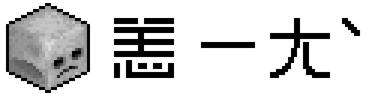

# I Feel Bad | 恙



[英文](../README.md)

## 1. 摘要

- 一个轻量级且高度可配置的 MC 模组, 主要功能是修改 MC 的死亡惩罚, 修改升级经验需求以及编辑实体生成后的属性
- 模组 ID = `i_feel_bad`
- **LICENSE** = `GNU Lesser General Public License v3.0`

## 2. 介绍

- `i_feel_bad` `恙` 引入了如下功能:
  - 加强死亡惩罚
    - 重新平衡的重生状态:
      - 玩家属性在重生后会重新计算, 这使得死亡成为一种真正有效的阻碍, 而非原版那样的某种意义上的饥饿值和生命值奖励 (尤其是开启 `keep_inventory` 后)
    - 重生后的负面效果:
      - 为重生的玩家添加 (负面) 状态效果, 并持续一定时间, 迫使玩家更加小心谨慎地处理潜在的风险
  - 其它功能
    - 经验机制修改:
      - 可以有选择性地取代原版游戏中不合理的升级经验需求, 现在可以是线性增长了 (或者零增长)
    - 实体生成后的属性修改:
      - 当实体生成后自定义修改他们的属性, 这能满足一些特殊需求, 比如说你需要加强或者削弱怪物
- 上面描述的功能都能独立开启关闭以及均具有比较丰富的自定义控制选项, 如果你不需要某个功能, 可以简单地关掉它, 这不会带来负面影响

## 3. 服务端还是客户端

- 这是一个纯服务器模组
- 如果用在服务器上, 则此模组在客户端不是必须的
- 单人游戏或局域网联机也可使用

## 4. 配置

- 下面是一个典型的默认配置文件 (NeoForge 端):

  ```toml
  # I Feel Bad 模组的通用设置
  [I_FEEL_BAD]
  # 启用 i_feel_bad (本模组); false 以禁用全部功能
  flag__enable_i_feel_bad = true
  # 模组运行期间生成日志
  flag__enable_logging = false
  # 检查配置是否合法
  flag__enable_config_check = false

  # 与生命值修改相关的配置项
  [hp_modification]
  # false 以禁用修改行为
  flag__enable_modification = true
  # 修改是通过函数 y=kx+b 实现的, 这是其中的参数 k;
  # 其中 y 代表新的值 (生成时的 hp), x 是旧值 (死亡时的 hp);
  # Default: 1.0
  # Range: -10000.0 ~ 10000.0
  coefficient__k = 1.0
  # 修改是通过函数 y=kx+b 实现的, 这是其中的参数 b;
  # Default: -4.0
  # Range: -10000.0 ~ 10000.0
  coefficient__b = -4.0
  # 修正后的目标值不会低于该值;
  # 该值需低于 maximum;
  # Default: 2.0
  # Range: 0.0 ~ 10000.0
  minimum = 2.0
  # 修正后的目标值不会超过这个上限;
  # Default: 100.0
  # Range: 0.0 ~ 10000.0
  maximum = 100.0

  # 与食物等级 (饱腹值) 修改相关的配置项
  [food_level_modification]
  # false 以禁用修改行为
  flag__enable_modification = true
  # 修改是通过函数 y=kx+b 实现的, 这是其中的参数 k;
  # 其中 y 代表新的值 (生成时的 food_level), x 是旧值 (死亡时的 food_level);
  # Default: 0.5
  # Range: -10000.0 ~ 10000.0
  coefficient__k = 0.5
  # 修改是通过函数 y=kx+b 实现的, 这是其中的参数 b;
  # Default: 2.0
  # Range: -10000.0 ~ 10000.0
  coefficient__b = 2.0
  # 修正后的目标值不会低于该值;
  # 该值需低于 maximum;
  # Default: 7.0
  # Range: 0.0 ~ 10000.0
  minimum = 7.0
  # 修正后的目标值不会超过这个上限;
  # Default: 100.0
  # Range: 0.0 ~ 10000.0
  maximum = 100.0

  # 与饱和度修改相关的配置项
  [saturation_modification]
  # false 以禁用修改行为
  flag__enable_modification = true
  # 修改是通过函数 y=kx+b 实现的, 这是其中的参数 k;
  # 其中 y 代表新的值 (生成时的 saturation), x 是旧值 (死亡时的 saturation);
  # Default: 0.0
  # Range: -10000.0 ~ 10000.0
  coefficient__k = 0.0
  # 修改是通过函数 y=kx+b 实现的, 这是其中的参数 b;
  # Default: 0.0
  # Range: -10000.0 ~ 10000.0
  coefficient__b = 0.0
  # 修正后的目标值不会低于该值;
  # 该值需低于 maximum;
  # Default: 0.0
  # Range: 0.0 ~ 10000.0
  minimum = 0.0
  # 修正后的目标值不会超过这个上限;
  # Default: 0.0
  # Range: 0.0 ~ 10000.0
  maximum = 0.0

  # 与状态效果赋予相关的配置项
  [status_effect_assignment]
  # 启用玩家重生后的状态效果赋予
  flag__enable_status_effect_assignment = true
  # 状态效果记录表; 字段:
  # string id | int *duration (in tick) | int *level (amplifier, [0, 255)) | bool *ambient | bool *visible | bool *show_icon
  # 字段可省略 (除 ID 外) 以保持默认;
  # 举例:
  #   [0] "minecraft:slowness,3000,"
  #   [1] "minecraft:slowness,,,"
  #   [2] "minecraft:slowness,,2,"
  # 常用的负面效果 id (也支持正面效果):
  # minecraft:slowness|mining_fatigue|instant_damage|blindness|hunger|weakness|darkness|...
  # 详见 wiki: https://minecraft.wiki/w/Effect
  list__status_effect_assignment_records = ["minecraft:infested,6000,0,false,true,true", "minecraft:mining_fatigue,3600,0,false,true,true", "minecraft:slowness,600,0,false,true,true", "minecraft:weakness,500,0,false,true,true", "minecraft:darkness,400,0,false,true,true"]

  # 与经验机制修改有关的配置项
  [experience_mechanism_modification]
  # 启用等级经验需求方法覆盖
  flag__enable_coverage = true
  # 升级所需的基础经验值
  # Default: 20
  # Range: > 1
  basic__exp_requirement = 20
  # 每一级所需经验值的增量
  # 最终的经验值需求 = 基础 + 增量 * 等级
  # Default: 0
  # Range: -100000000 ~ 100000000
  increment__exp_req_per_level = 0
  # 最低经验值需求, 最终结果不会低于该值
  # Default: 1
  # Range: > 1
  minimum__exp_req_for_each_level = 1
  # 最高经验值需求, 最终结果不会高于该值
  # Default: 100
  # Range: > 1
  maximum__exp_req_for_each_level = 100

  # Configurations related to modification of entity attributes when spawning
  # 与实体生成时的属性修改相关的配置项
  [entity_attributes_modification]
  # 启用实体生成时的属性修改
  flag__enable_entity_attributes_modification = false
  # 由实体集合定义组成的列表; 字段:
  # string id | bool flag__and_mode | double probability | ENTRY_0 | ENTRY_1 | ...
  # ----------------------------------------------------------------------
  # id             : 该集合用于引用的标识符;
  # flag__and_mode : 启用子项 (ENTRY) 间的逻辑 "与" 模式, 默认为 "或" 模式;
  # probability    : 执行当前程序的概率;
  # ----------------------------------------------------------------------
  # 上面的 ENTRY_0, ENTRY_1 ... 具有如下格式:
  # !@#minecraft:zombies
  # ----------------------------------------------------------------------
  # !                 : 逻辑非, 省略以禁用;
  # @                 : 命名空间匹配模式, 省略以禁用;
  # #                 : 实体标签匹配模式, 省略以禁用;
  # minecraft:zombies : 实体 ID/TAG 字符串
  # ----------------------------------------------------------------------
  # 可以定义任意数量的实体集合子项;
  # 可以使用任意无效的 ID 并取反来匹配所有的实体, 例如: "!i_feel_bad:none";
  # ----------------------------------------------------------------------
  # 详见 wiki:
  #   https://minecraft.wiki/w/Mob
  list__entity_sets = ["entities__0,false,1.00,minecraft:zombie"]
  # a list of entity attribute record; fields:
  # 实体属性记录表; 字段:
  # string id | bool flag__fix_attribute | double probability | ENTRY_0 | ENTRY_1 | ...
  # ----------------------------------------------------------------------
  # id                  : 该属性记录用于引用的标识符;
  # flag__fix_attribute :
  #   [0] 当修改 max_health 时同步更新生命值;
  #   [1] 修复当修改 follow_range 时的更新漏洞 (https://bugs.mojang.com/browse/MC-145656);
  # probability         : 执行当前记录的概率;
  # ----------------------------------------------------------------------
  # 上面的 ENTRY_0, ENTRY_1 ... 具有如下格式:
  # (?0.50) +minecraft:generic.max_health=1.00x+10.00 $10.00 [1.00~1000.00]
  # ----------------------------------------------------------------------
  # (?0.50)        : 当前子项的执行概率;
  # +              : 强制模式, 省略以禁用;
  # minecraft:generic.max_health : 目标属性的 ID;
  # 1.00x+10.00    : calculated_value = 1.0 * old_value + 10.0;
  # $10.00         : floating_value 将会是范围 [calculated_value-10.0, calculated_value+10.0] 内的随机值;
  # [1.00~1000.00] : floating_value 将被限制在该范围内并获得 final_value;
  # ----------------------------------------------------------------------
  # 可以定义任意数量的属性修改子项;
  # 详见 wiki:
  #   https://minecraft.wiki/w/Attribute
  list__attribute_records = ["modification__0,true,1.00,(?0.80) minecraft:generic.max_health=1.00x+10.00 $10.00 [1.00~1000.00],(?0.80) minecraft:generic.armor=1.00x+10.00 $10.00 [1.00~1000.00]"]
  # ID 映射表; 字段:
  # string id__entity_set | string id__attribute_record
  # 该列表定义了哪些属性修改将被应用于哪些实体集合;
  # 这是一个多对多映射; 非法的 ID 将被忽略
  list__id_mappings = ["entities__0,modification__0"]

  ```

- 配置项的说明已经包含在文件注释中, 这里不再赘述

## 5. 注释

- 因为一些技术原因, 本模组的 `fabric` 版本:
  - 不支持配置文件热重载 (即游戏运行时更新), 因此修改配置后必须重启才能生效
  - 不支持在配置文件中生成注释
  - 不会校验配置文件合法性, 当配置内容不合法时可能导致崩溃和其它问题
  - `fabric` 版是后续添加的, 可能会有其它问题
- 如果对功能实现有什么建议, 或者需要其它的功能, 可以发表议题 (issue)

